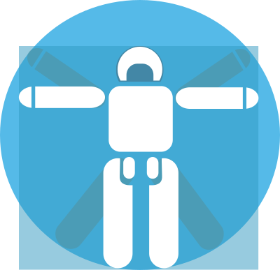

# RoboticsLab Slides Template

Plantilla Quarto / Markdown para presentaciones de congresos internacionales, simposios, presentaciones de papers, charlas técnicas cortas y resultados experimentales.

Esta plantilla está pensada para presentaciones de Robótica, Automatización y Bioingeniería afiliadas al RoboticsLab de la Universidad Carlos III de Madrid.

---

## Qué incluye

```text
roboticslab-slides/
├── README.md
├── template.qmd
├── template.html
├── _extensions/
│   └── roboticslab-slides/
│       ├── _extension.yml
│       ├── custom.scss
│       └── assets/
│           └── backgrounds/
│               ├── dark/
│               ├── light/
│               ├── slide1.svg
│               ├── section1.svg
│               └── ...
├── assets/
│   ├── logos/
│   └── figures/
└── template_files/
```

- `template.qmd`: plantilla base para crear una presentación.
- `template.html`: layout personalizado para presentaciones Reveal.js.
- `_extensions/roboticslab-slides/`: extensión Quarto con el tema, SCSS, fondos y recursos reutilizables.
- `_extensions/roboticslab-slides/assets/backgrounds/`: fondos SVG reutilizables de la plantilla.
- `assets/logos/`: logos específicos de cada presentación.
- `assets/figures/`: figuras, resultados, capturas, CAD renders y diagramas del paper.
- `template_files/`: dependencias generadas o usadas por Quarto.

---

## Instalación

Reemplaza `<github-organization>` por tu usuario u organización de GitHub:

```bash
quarto use template <github-organization>/roboticslab-slides
```

Ejemplo:

```bash
quarto use template SergioJacobo/roboticslab-slides
```

Luego entra en la carpeta generada y renderiza:

```bash
quarto render template.qmd
```

---

## Estructura recomendada para una presentación

```text
my-conference-presentation/
├── presentation.qmd
├── assets/
│   ├── logos/
│   └── figures/
└── _extensions/
    └── roboticslab-slides/
        ├── _extension.yml
        ├── custom.scss
        └── assets/
            └── backgrounds/
```

Regla práctica:

- Fondos genéricos de plantilla: `_extensions/roboticslab-slides/assets/backgrounds/`.
- Logos, figuras y resultados de cada presentación: `assets/` en la raíz del proyecto.

---

## Uso básico

El YAML mínimo es:

```yaml
---
format:
  roboticslab-slides-revealjs: default
---
```

Cada slide real debe comenzar con `##`:

```markdown
## Introduction

### Motivation

- First point
- Second point
- Third point
```

> Importante: usa `##` para las diapositivas principales. Evita iniciar secciones reales con `#`, salvo que sepas exactamente cómo quieres que Reveal.js trate los niveles de encabezado.

---

## Cover principal

La portada usa la clase `.rl-cover`. El fondo puede indicarse directamente desde el QMD usando `background-image`.

```markdown
## Cover {.rl-cover .rl-cover-dark .rl-logos-compact background-image="_extensions/roboticslab-slides/assets/backgrounds/dark/cover-srar.svg" background-size="cover" background-position="center" footer=false}

::: {.rl-cover-top}
::: {.rl-event}
International Symposium / Conference Name · City · Date
:::

::: {.rl-cover-logos}
{.rl-logo}
{.rl-logo}
{.rl-logo}
{.rl-logo .rl-logo-wide}
:::
:::

::: {.rl-cover-main}
::: {.rl-cover-label}
Research line / project name
:::

::: {.rl-kicker}
Oral presentation
:::

::: {.rl-paper-title}
Your Technical Paper Title Goes Here
:::

::: {.rl-authors}
Author One · Author Two · Author Three · Author Four
:::

::: {.rl-affiliation}
Department / Laboratory · University or Research Institution
:::
:::

::: {.rl-cover-bottom}
Project name · Research group · Funding or event note
:::
```

### Variantes de cover

```markdown
## Cover {.rl-cover .rl-cover-dark background-image="..." background-size="cover" background-position="center" footer=false}
```

```markdown
## Cover {.rl-cover .rl-cover-light background-image="..." background-size="cover" background-position="center" footer=false}
```

```markdown
## Cover {.rl-cover .rl-cover-dark .rl-logos-compact background-image="..." background-size="cover" background-position="center" footer=false}
```

---

## Slide final / closing

Para el cierre se recomienda usar `.rl-cover-closing` y `.rl-closing-thanks`.

```markdown
## Closing {.rl-cover .rl-cover-closing .rl-cover-dark .rl-logos-compact background-image="_extensions/roboticslab-slides/assets/backgrounds/dark/cover-srar.svg" background-size="cover" background-position="center" footer=false}

::: {.rl-cover-top}
::: {.rl-event}
International Symposium / Conference Name · City
:::

::: {.rl-cover-logos}
{.rl-logo}
{.rl-logo}
{.rl-logo}
{.rl-logo .rl-logo-wide}
:::
:::

::: {.rl-cover-main}
::: {.rl-closing-thanks}
Thank you
:::

::: {.rl-kicker}
Discussion
:::

::: {.rl-paper-title}
Questions?
:::

::: {.rl-authors}
Your Technical Paper Title Goes Here
:::

::: {.rl-affiliation}
Presenter name · Institution · contact@email.com
:::
:::

::: {.rl-cover-bottom}
Project name · Research group · Contact / repository
:::
```

---

## Slides normales

Por defecto, las diapositivas normales usan el fondo oscuro de la plantilla:

```markdown
## Normal dark slide

### Subtitle

- Bullet 1
- Bullet 2
```

Fondos predefinidos:

```markdown
## Light slide {.rl-bg-light}
```

```markdown
## Teal slide {.rl-bg-teal}
```

```markdown
## Navy slide {.rl-bg-navy}
```

```markdown
## Gold slide {.rl-bg-gold}
```

### Fondos disponibles para slides normales

- `.rl-bg-dark`
- `.rl-bg-navy`
- `.rl-bg-light`
- `.rl-bg-teal`
- `.rl-bg-mint`
- `.rl-bg-pearl`
- `.rl-bg-gold`

---

## Slide de título grande centrado

```markdown
## METHODS {.rl-big-title .rl-bg-navy .rl-word-aqua}

### Control architecture and HIL setup
```

```markdown
## RESULTS {.rl-big-title .rl-bg-light .rl-word-petrol .rl-big-xl}

### Experimental validation
```

### Tamaños disponibles

```markdown
## TITLE {.rl-big-title .rl-big-md}
## TITLE {.rl-big-title .rl-big-lg}
## TITLE {.rl-big-title .rl-big-xl}
```

### Colores de palabra disponibles

- `.rl-word-white`
- `.rl-word-dark`
- `.rl-word-navy` / `.rl-word-ink`
- `.rl-word-teal` / `.rl-word-petrol`
- `.rl-word-cyan` / `.rl-word-aqua`
- `.rl-word-blue`
- `.rl-word-yellow` / `.rl-word-gold`
- `.rl-word-orange`
- `.rl-word-magenta` / `.rl-word-rose`
- `.rl-word-pink`

---

## Slides divididas 30/70

```markdown
## Main idea {.rl-split-30-70 .rl-light}

- Bullet 1
- Bullet 2
- Bullet 3

The supervisor decides whether actuation is useful or whether the system should remain idle.
```

```markdown
## Interpretation {.rl-split-30-70 .rl-dark}

- Thermal robustness is not only a material issue.
- It is also a control allocation issue.
- IDLE is an active supervisory decision.
```

### Variantes disponibles

- `.rl-light`
- `.rl-dark`
- `.rl-teal`
- `.rl-navy`

---

## Slides con fondos SVG personalizados

La plantilla permite fondos SVG animados o estáticos. Estos slides usan clases `theme-*`.

```markdown
## .theme-title1 {.theme-title1 .rl-theme-dark}

### Technical title slide
```

```markdown
## .theme-title2 {.theme-title2 .rl-theme-dark .rl-up}

### Shifted title
```

```markdown
## Section title {.theme-section1 .rl-theme-light}

### Subtitle for a light SVG background

Text content can go here.
```

```markdown
## Technical slide {.theme-slide1 .rl-theme-dark}

### Subtitle

- Point 1
- Point 2
```

---

## Control de color para fondos SVG: dark / light

Los fondos SVG pueden ser oscuros o claros. Para evitar que el texto blanco se pierda sobre un fondo claro, usa una clase de contraste.

### Para fondos oscuros

```markdown
## .theme-title1 {.theme-title1 .rl-theme-dark}

### Light text over dark background
```

Alias:

```markdown
## .theme-title1 {.theme-title1 .theme-dark}
## .theme-title1 {.theme-title1 .rl-on-dark}
```

### Para fondos claros

```markdown
## .theme-title1 {.theme-title1 .rl-theme-light}

### Dark text over light background
```

Alias:

```markdown
## .theme-title1 {.theme-title1 .theme-light}
## .theme-title1 {.theme-title1 .rl-on-light}
```

### Acentos para slides SVG

```markdown
## Control {.theme-section1 .rl-theme-dark .rl-theme-accent-gold}

### Closed-loop supervision
```

```markdown
## Results {.theme-section2 .rl-theme-light .rl-theme-accent-petrol}

### Experimental validation
```

Acentos disponibles:

- `.rl-theme-accent-aqua`
- `.rl-theme-accent-gold`
- `.rl-theme-accent-rose`
- `.rl-theme-accent-petrol`

---

## Posicionamiento vertical en title slides

```markdown
## .theme-title1 {.theme-title1 .rl-theme-dark .rl-up}

### Text shifted upward
```

```markdown
## .theme-title1 {.theme-title1 .rl-theme-dark .rl-down}

### Text shifted downward
```

---

## Fondos desde la extensión

Para fondos reutilizables de plantilla, coloca los SVG dentro de:

```text
_extensions/roboticslab-slides/assets/backgrounds/
```

Ejemplo en SCSS:

```scss
.theme-slide1:is(.slide-background) {
  background-image: url("/_extensions/roboticslab-slides/assets/backgrounds/slide1.svg");
  @include background-full;
}
```

Para covers importantes, también puedes llamar el fondo directamente desde QMD:

```markdown
## Cover {.rl-cover .rl-cover-dark background-image="_extensions/roboticslab-slides/assets/backgrounds/dark/cover-control.svg" background-size="cover" background-position="center" footer=false}
```

---

## Logos

Los logos se colocan en `assets/logos/`.

```markdown
::: {.rl-cover-logos}
{.rl-logo}
{.rl-logo}
{.rl-logo}
{.rl-logo .rl-logo-wide}
:::
```

Usa `.rl-logo-wide` para logos horizontales o más largos.

---

## Figuras

Coloca figuras de cada presentación en:

```text
assets/figures/
```

Ejemplo:

```markdown
## Experimental setup {.rl-bg-light}

{fig-align="center" width="85%"}
```

---

## Colores de texto inline

```markdown
The [thermal-aware supervisor]{.rl-text-aqua .rl-bold} reduces unnecessary heating.
```

```markdown
The [maximum error]{.rl-text-gold .rl-bold} remained below the safety threshold.
```

Colores disponibles:

- `.rl-text-white`
- `.rl-text-dark`
- `.rl-text-navy` / `.rl-text-ink`
- `.rl-text-teal` / `.rl-text-petrol`
- `.rl-text-cyan` / `.rl-text-aqua`
- `.rl-text-blue`
- `.rl-text-yellow` / `.rl-text-gold`
- `.rl-text-orange`
- `.rl-text-magenta` / `.rl-text-rose`
- `.rl-text-pink`
- `.rl-text-red` / `.rl-text-coral`
- `.rl-text-green`
- `.rl-text-purple` / `.rl-text-violet`
- `.rl-text-graphite`

---

## Negrita, seminegrita y texto atenuado

```markdown
[Important result]{.rl-bold}
```

```markdown
[Secondary idea]{.rl-semi-bold}
```

```markdown
[Less important note]{.rl-muted}
```

---

## Highlights / marcadores

```markdown
The [main contribution]{.rl-mark-yellow} is an indirect thermal-aware supervisor.
```

```markdown
The controller achieved [safe tracking]{.rl-mark-cyan .rl-bold} without persistent thermal saturation.
```

Marcadores disponibles:

- `.rl-mark-yellow`
- `.rl-mark-pink`
- `.rl-mark-cyan`
- `.rl-mark-green`
- `.rl-mark-orange`
- `.rl-mark-purple`

---

## Subrayados de color

```markdown
This is a [key control idea]{.rl-u-aqua .rl-bold}.
```

```markdown
This is a [critical limitation]{.rl-u-rose .rl-bold}.
```

Subrayados disponibles:

- `.rl-u-teal` / `.rl-u-petrol`
- `.rl-u-cyan` / `.rl-u-aqua`
- `.rl-u-blue`
- `.rl-u-yellow` / `.rl-u-gold`
- `.rl-u-orange`
- `.rl-u-magenta` / `.rl-u-rose`
- `.rl-u-pink`
- `.rl-u-green`
- `.rl-u-purple` / `.rl-u-violet`
- `.rl-u-coral`

---

## Fuentes manuales

```markdown
[Sans text]{.rl-font-sans}
```

```markdown
[Serif text]{.rl-font-serif}
```

```markdown
[Code-like text]{.rl-font-mono}
```

Clases disponibles:

- `.rl-font-sans`
- `.rl-font-serif`
- `.rl-font-mono`

---

## Ejemplo completo de secuencia para paper corto

```markdown
## Cover {.rl-cover .rl-cover-dark .rl-logos-compact background-image="_extensions/roboticslab-slides/assets/backgrounds/dark/cover-control.svg" background-size="cover" background-position="center" footer=false}

<!-- cover content -->

## MOTIVATION {.rl-big-title .rl-bg-navy .rl-word-aqua}

### SMA ankle actuation is powerful, but thermally limited

## Problem {.rl-bg-light}

### Thermal accumulation limits sustained SMA actuation

- Point 1
- Point 2
- Point 3

## Proposed idea {.rl-split-30-70 .rl-light}

- Indirect thermal-aware supervision
- Event-driven IDLE state
- Closed-loop BPID tracking

## SYSTEM {.rl-big-title .rl-bg-dark .rl-word-gold}

### Agonist–antagonist SMA ankle module

## Control architecture {.theme-section1 .rl-theme-light .rl-theme-accent-petrol}

### Supervisor + controller + HIL

## RESULTS {.rl-big-title .rl-bg-light .rl-word-petrol .rl-big-xl}

### Experimental validation

## Long-duration test {.rl-bg-navy}

### 40-minute closed-loop endurance

[Global RMSE]{.rl-text-aqua .rl-bold}: 0.218°  
[Maximum error]{.rl-text-gold .rl-bold}: 1.384°

## Closing {.rl-cover .rl-cover-closing .rl-cover-dark .rl-logos-compact background-image="_extensions/roboticslab-slides/assets/backgrounds/dark/cover-control.svg" background-size="cover" background-position="center" footer=false}

<!-- closing content -->
```

---

## Buenas prácticas

- Usa `##` para cada diapositiva real.
- Usa `.rl-bg-light` o `.rl-bg-pearl` para slides densas con mucho texto.
- Usa `.rl-bg-navy` para resultados técnicos o mensajes fuertes.
- Usa `.rl-big-title` para separar secciones.
- Usa `.rl-split-30-70` para explicar una idea principal con detalle.
- Usa `.rl-theme-dark` o `.rl-theme-light` siempre que uses un fondo SVG personalizado.
- Usa `assets/figures/` para resultados específicos de cada paper.
- Usa `_extensions/roboticslab-slides/assets/backgrounds/` para fondos reutilizables de la plantilla.

---

## Renderizado

```bash
quarto render template.qmd
```

Para previsualizar:

```bash
quarto preview template.qmd
```

---

## Personalización

- Ajusta colores, fuentes y estilos globales en `_extensions/roboticslab-slides/custom.scss`.
- Añade nuevos fondos SVG en `_extensions/roboticslab-slides/assets/backgrounds/`.
- Añade figuras específicas en `assets/figures/`.
- Añade logos específicos en `assets/logos/`.
- Modifica `template.html` solo si necesitas cambiar la estructura HTML base.

---

## Licencia

Esta plantilla se distribuye bajo la licencia MIT. Consulta `LICENSE` para más detalles.
